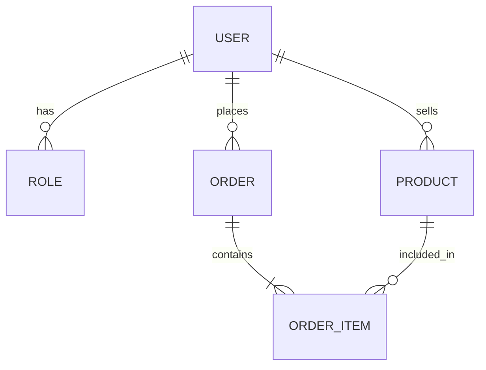

# Order Hub - Cloud-Native Order Management System

*Sistema escalável de pedidos com arquitetura orientada a eventos, observabilidade e infraestrutura como código*

Este projeto é uma API Backend robusta que simula o core de um e-commerce. O foco principal foi aplicar padrões de **Sistemas Distribuídos**, garantindo que a criação de pedidos, atualização de estoque e notificações ocorram de forma resiliente e eventual consistente na **AWS**.

---

## Arquitetura e Fluxo de Dados

O projeto utiliza uma arquitetura orientada a eventos para garantir desacoplamento e escalabilidade:

1. **Criação de Pedido:** O usuário solicita um pedido via API REST.

2. **Persistência e Outbox:** O pedido é salvo no **Amazon RDS**, e um registro de "evento pendente" é salvo na mesma transação (**Transactional Outbox Pattern**).

3. **Mensageria (Kafka):** Um worker lê a tabela de outbox e publica no **Amazon MSK**.

4. **Consumo e Estoque:** O serviço de inventário consome o evento e atualiza o saldo de produtos.

5. **Notificação:** Um evento de sucesso dispara uma mensagem para o **Amazon SNS**, que simula o envio de e-mails/push.

---

## Stack

| Camada | Tecnologia | Motivação |
| --- | --- | --- |
| **Linguagem** | Java 21 + Spring Boot 3 | Aproveitando as Virtual Threads e melhorias de performance. |
| **Banco de Dados** | Amazon RDS (Postgres) | Banco relacional robusto para consistência ACID. |
| **Mensageria** | Amazon MSK (Kafka) | Alta vazão para eventos de domínio e histórico de pedidos. |
| **Notificação** | Amazon SNS | Notificação ao usuário e setores |
| **Cache/Sessão** | Amazon ElastiCache (Redis) | Gerenciamento de tokens JWT e Refresh Tokens com alta performance. |
| **Infraestrutura** | AWS App Runner | Deploy de containers automático com auto-scaling simplificado. |
| **IaC** | Terraform | Garantia de que toda a infraestrutura é versionada e reproduzível. |

---

## Diferenciais de Nível Produção

### Segurança e RBAC

Implementação de **Spring Security** com JWT. O sistema diferencia permissões de `ADMIN` (gerenciamento de produtos) e `USER` (realização de compras), com fluxos de **Refresh Token** armazenados no Redis para garantir segurança e performance na validação.

### Observabilidade (Monitoramento)

A aplicação está preparada para ambientes produtivos:

* **Métricas:** Uso do Spring Actuator + Micrometer enviando dados para o **Amazon CloudWatch**.

* **Rastreamento Distribuído:** Implementação de **Micrometer Tracing** (antigo Sleuth) integrado ao **AWS X-Ray**, permitindo visualizar o gargalo de uma requisição desde a API até a publicação no Kafka.

### Resiliência

* **Transactional Outbox:** Evita a perda de mensagens caso o broker (Kafka) esteja fora do ar no momento da compra.

* **Idempotência:** Consumidores preparados para processar a mesma mensagem múltiplas vezes sem duplicar a baixa no estoque.

---

## Modelo de Dados

User <-> Roles {
  - (N:M)
  - Um user pode ser Admin e Editor
  - A regra "Admin pertence a vários usuários"
}

User <-> Product {
  - (1:N)
  - Usuário age como o vendedor do anúncio
}

User <-> Order {
  - (1:N)
  - Usuário age como o comprador
}

Order <-> OrderItem {
  - (1:N)
  - Composição
}

Product <-> OrderItem {
  - (1:N)
  - Um produto pode aparecer em várias vendas diferentes
}

---

## Endpoints Principais (REST)

### Autenticação

* `POST /api/auth/register` (Público) - Registro de novo usuário.

* `POST /api/auth/login` (Público) - Login com retorno de Access e Refresh Token.

### Produtos e Pedidos

* `GET /api/products` (Público) - Lista todos os produtos com paginação.

* `GET /api/products/{name}` (público) - usca detalhes de um produto pelo nome.

* `POST /api/products` (Admin) - Cadastra um novo produto no catálogo.

### Pedidos

* `POST /api/orders` (User Auth) - Finaliza um carrinho e gera um novo pedido.

* `GET /api/orders/{id}` (User Auth & Admin) - Consulta o status e detalhes de um pedido específico.

* `GET /api/admin/orders` (Admin) - Lista todos os pedidos realizados na plataforma.
